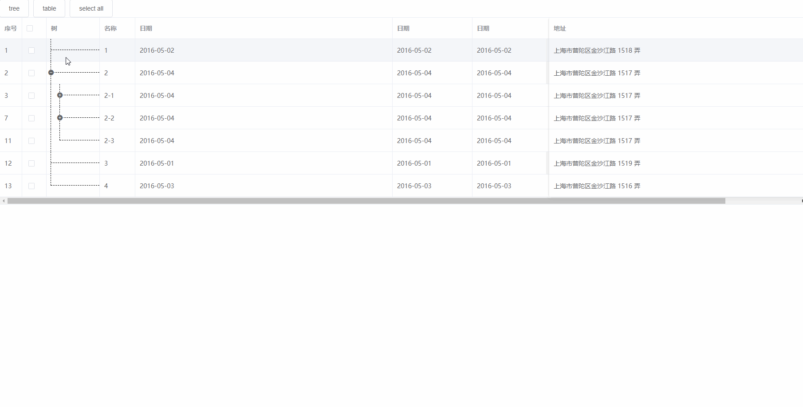

# table-tree-element

对原 `ele-table` 的拓展，支持 `<el-table-column type="tree" label="树" width="120" />` 的形式直接渲染树，使用它跟 `index`、`selection` 一样简单。


## demo

> 由于依赖包的关系，需要 nodejs10.15.0+ 才能运行当前示例
> 可以通过设置 expand 字段规定哪些节点初始默认展开



## Project setup

```
yarn install
```

### Compiles and hot-reloads for development
```
yarn serve
```

### Compiles and minifies for production
```
yarn build
```

### Lints and fixes files
```
yarn lint
```

### Customize configuration
See [Configuration Reference](https://cli.vuejs.org/config/).
